# Getting Started

ProcessEngine und BPMN Studio bilden eine verteilte, quelloffene Laufzeit- und Entwicklungsumgebung für BPMN-basierte Geschäftsprozesse.

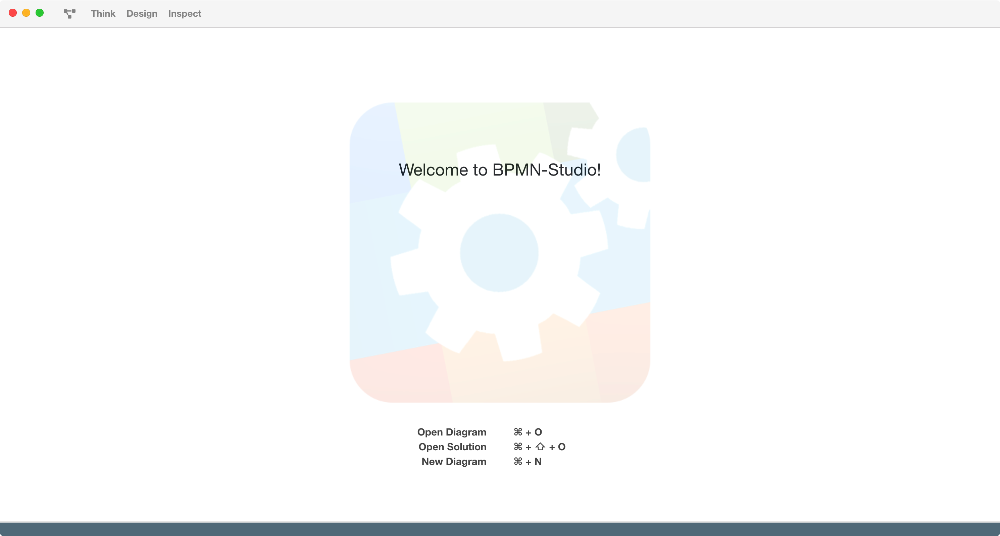

## BPMN Studio und die ProcessEngine

ProcessEngine.io ist die Workflow-Engine von [5Minds](https://5minds.de).

Im Gegensatz zu vielen anderen Lösungen in diesem Bereich ist ProcessEngine quelloffen und bietet mit BPMN Studio eine integrierte Entwicklungsumgebung zum grafischen Entwerfen **und** Ausführen von Prozessen.

ProcessEngine.io unterstützt somit eine zielgerichtete, iterative Entwicklung und Sie können sich auf das konzentrieren, was zählt: **Ihr Business und Ihre Nutzer.**

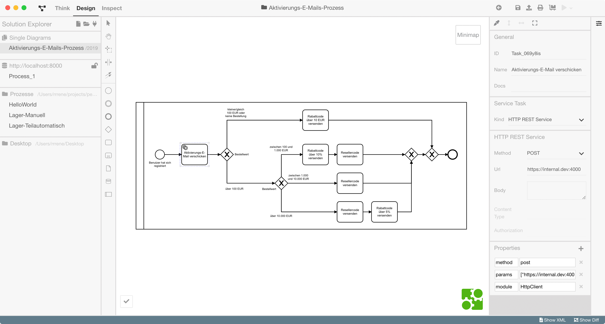

Mit BPMN Studio kann der Benutzer nicht nur Prozesse durchdenken, entwerfen und validieren, sondern sie auch direkt in BPMN Studio ausführen.
BPMN Studio bringt hierzu eine integrierte ProcessEngine mit, welche automatisch gestartet wird und es jedem ermöglicht, seine Prozesse auch ohne Serverlandschaft auszuführen.


## Das "Hello World" der digitalen Transformation

Viele Einführungstexte zu Programmiersprachen und anderen IT-Themen enthalten ein sog. "Hello World", ein bewusst einfach gehaltenes Beispiel, welches die jeweilige Technologie in ihren Grundzügen präsentiert.

Das könnte für das Starten von Prozessen folgendermaßen aussehen.

```csharp
// C#
var client = new ProcessEngineClient("http://localhost:8000");
var result = await client.StartProcessInstance('helloWorld', 'sayHello');
```

Die Parameter haben folgende Bedeutung:

* `http://localhost:8000` - die Adresse der internen ProcessEngine des BPMN Studios
* `helloWorld` - die ID des Prozesses, den wir starten wollen
* `sayHello` - die ID des Start-Events, das wir auslösen wollen

In BPMN Studio lassen sich diese Eigenschaften bearbeiten:

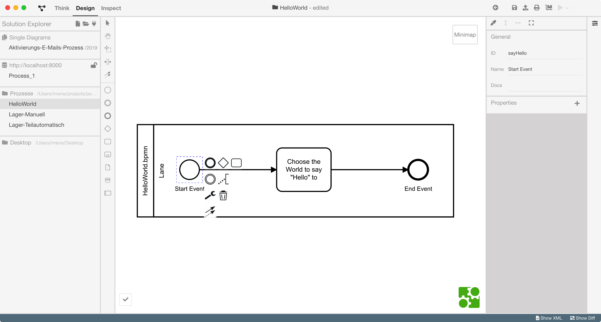

Doch die Prozesse im eigenen Unternehmen sind natürlich mehr als ein Start-Aufruf.
Um die ProcessEngine und ihre Vorzüge besser darstellen zu können, wollen wir daher ein Beispiel aus dem Bereich E-Commerce aufgreifen:

**Der Online-Shop**

In einem Online-Shop sollen Nutzer im Rahmen der Registrierung einen Rabattcode erhalten.
Nutzer, die besonders viel Ware bestellen, sollen zudem einen sog. Reseller-Code erhalten, der ihnen ermöglicht besondere Mengen-Rabatte zu aktivieren.

Üblicherweise werden diese Regeln in vielen, vielen E-Mails und Gesprächen kommuniziert, bevor sie dann im Programmcode niedergeschrieben werden.
Regelmäßig scheinen einige der Anforderungen sich zu widersprechen, so dass Techniker und Nicht-Techniker in einen intensiven Dialog treten müssen, um herauszufinden, wo sich "Wunsch und Wirklichkeit" unterscheiden.

Die Lösung ist, sich gemeinsam ein Bild zu machen.

Nehmen Sie folgende Kette an Anforderungen aus einer E-Mail-Konversation:

* Wir müssen bei der Registrierung auch einen Aktivierungscode verschicken, mit dem User ihre E-Mail-Adresse aktivieren.
* Dann sollten Benutzer, die sich bei ihrem ersten Einkauf registriert haben, noch einen Rabattcode über 10% des Warenwerts, aber jeder Nutzer einen Code über mindestens 10,00 EUR bekommen.
* Falls Benutzer sich während der Bestellung erstmalig registriert haben, dann muss geguckt werden, ob sie Waren im Wert von über 1.000 EUR bestellt haben. Dann sollen sie auch einen Resellercode angeboten bekommen, zusätzlich zum Rabattcode.
* Reseller, die so viel bestellen, dürfen natürlich keinen 10%-Rabattcode kriegen
* Reseller, die sogar über 10.000 EUR bestellen, sollten natürlich trotzdem einen Rabattcode bekommen (aber nur für 5%). Aber die E-Mail dafür darf erst nach der für den Reseller-Code rausgehen!

Nach Erstellen des Prozessdiagramms sehen wir, dass die scheinbar widersprüchlichen Anforderungen weniger konfus sind als gedacht:

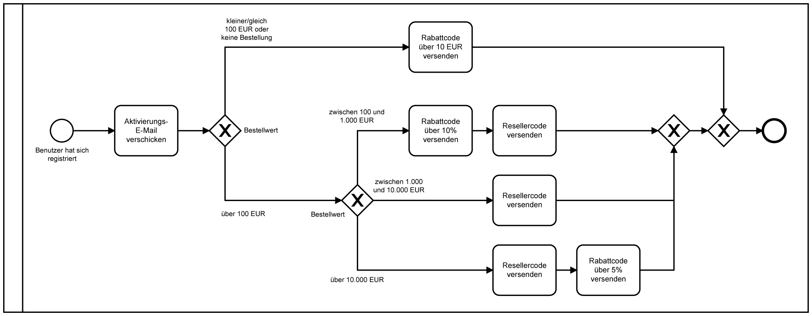

Eine Workflow-Engine ermöglicht, Diagramme wie dieses direkt auszuführen und so zum einen die Abläufe mit allen im Team zu diskutieren (insbesondere den Fachexperten, die nicht zwingenderweise Techniker sind!) sowie Unterschiede zwischen der Dokumentation und dem Programmcode zu vermeiden.

### Steuerung per BPMN Studio

Zunächst müssen sie BPMN Studio herunterladen, anschließend Das Diagramm herunterladen.
Wenn Sie das Studio starten, wird automatisch eine ProcessEngine-Instanz gestartet.


Zum Ausführen des Diagramms müssen wir ein Deployment auf diese interne ProcessEngine vornehmen.
Dies geschieht durch einen Klick auf "Deploy to ProcessEngine" (in der Toolbar, oben rechts).

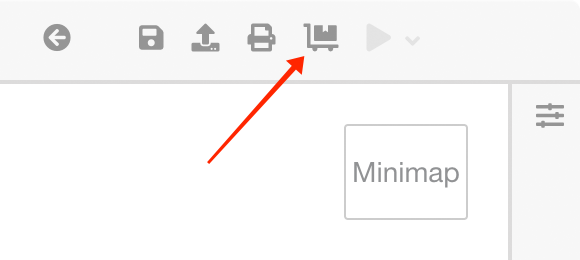

Anschließend kann das Diagramm per Klick auf "Run" ausgeführt werden (ebenfalls oben rechts in der Toolbar).

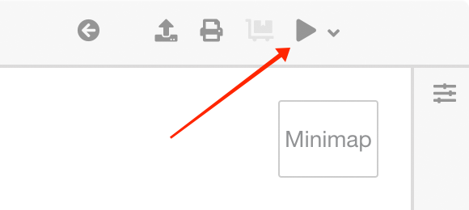

Prozesse können mit individuellen Parametern gestartet werden.

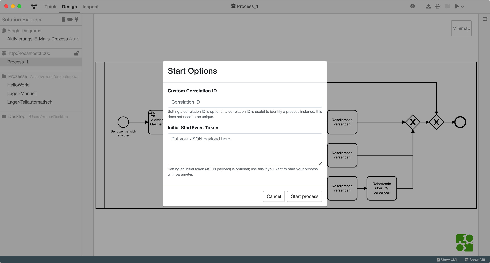

Während der Ausführung können Prozesse im sog. "Live Execution Tracker" analysiert werden.

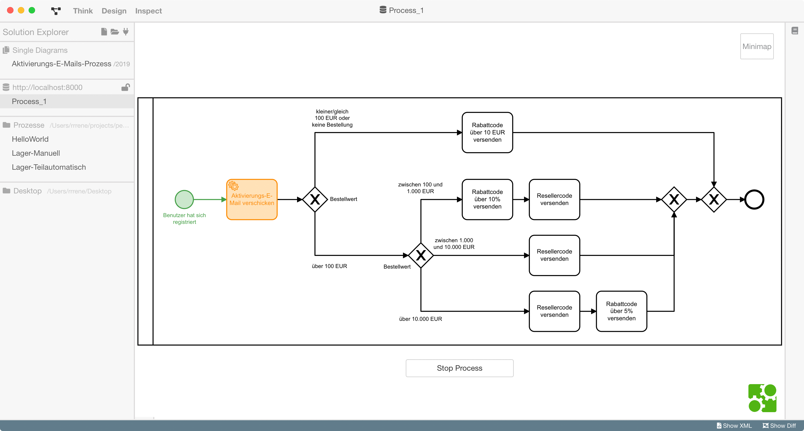

Neben der Steuerung von Prozessen mit Hilfe des BPMN Studios lassen sich die gezeigten Funktionen natürlich auch durch Skripte über die ProcessEngine API automatisieren.

### Steuerung per Skript

### Starten von Prozessen

Die Steuerung des Diagramms aus einem Skript heraus ist denkbar einfach.

Wie weiter oben bereits angedeutet, lassen sich Prozesse nach dem Deployment (das muss mit BPMN Studio erfolgen) mit Hilfe des `ProcessEngineClient` starten:

```csharp
// C#
internal class Program
{
    private static void Main(string[] args)
    {
        StartNewProcessInstance().GetAwaiter().GetResult();
    }

    private static async Task StartNewProcessInstance()
    {
        var client = new ProcessEngineClient("http://localhost:8000");

        var request = new ProcessStartRequest<StartPayload>();
        request.Payload.ShoppingCardAmount = 1000;

        Console.WriteLine("Prozess 'Benutzeraktivierung' mit Start-Event 'StartAktivierung' gestartet.");

        var result = await client.StartProcessInstance<StartPayload, object>(
            "Benutzeraktivierung",
            "StartAktivierung",
            request,
            "EndeAktivierung");

        Console.WriteLine($"Prozess beendet (CorrelationId: '{result.CorrelationId}').");
        Console.Write("Daten: ");
        Console.WriteLine(result.Payload);
    }
}
```

### Erstellen von External Task Workern

Das "External Task Pattern" sieht vor, dass zu erledigende Arbeiten in einem vereinheitlichten Arbeitsvorrat hinterlegt werden.
Dort können sie von "External Task Workern" abgeholt und bearbeitet werden.
Durch diese Entkopplung können die Worker in jeder beliebigen Programmiersprache implementiert werden.
Der zuständige Worker hinterlegt anschließend das Arbeitsergebnis im Arbeitsvorrat, wo die ProcessEngine es abholen und mit der Prozessausführung fortführen kann.

Das Pattern stellt somit eine Alternative zur Anbindung von REST-Service-Endpunkten dar.

Die folgende Abbildung stellt beide Konzepte gegenüber:

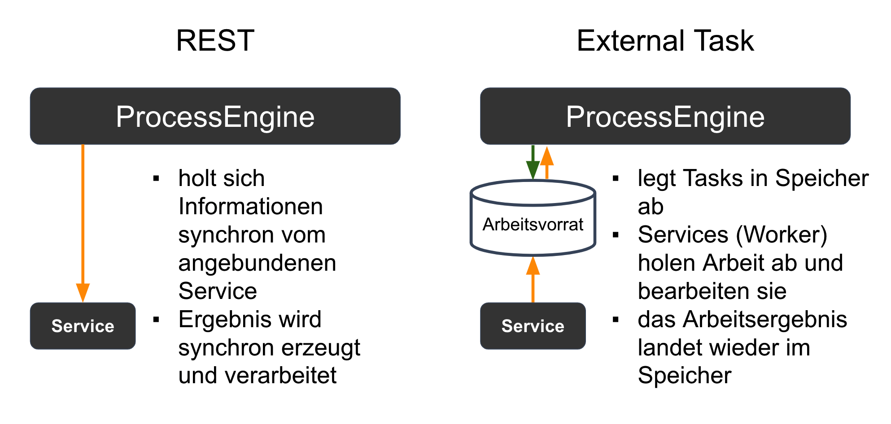


Ein ExternalTaskWorker für den External Task "Aktivierungs-E-Mail versenden" aus unserem Online-Shop-Beispiel könnte wie folgt aussehen:

```csharp
// C#
internal class Program
{
    private static void Main(string[] args)
    {
        RunSampleExternalTaskWorker().GetAwaiter().GetResult();
    }

    private static async Task RunSampleExternalTaskWorker()
    {
        var client = new ProcessEngineClient("http://localhost:8000");

        await client.WaitForHandle<TestPayload>("AktivierungsemailSenden", async (externalTask) => {
            var result = await DoSomeLongWork(externalTask.Payload);

            var externalTaskFinished = new ExternalTaskFinished<TestResult>(externalTask.Id, result);

            return externalTaskFinished;
        });
    }

    private async static Task<TestResult> DoSomeLongWork(TestPayload payload)
    {
        var result = new TestResult();
        result.ShoppingCardAmount = payload.ShoppingCardAmount;

        // zur Simulation einer rechenintensiven Aufgabe
        await Task.Delay(10000);

        return result;
    }
}
```


## Prozesse modellieren

### Was ist BPMN?

BPMN (Business Process Model and Notation) ist eine XML-basierte, ausführbare Modellierungssprache für Geschäftsprozesse.

Sie wurde in der Version 2.0 in [ISO/IEC 19510:2013](https://www.iso.org/standard/62652.html) standardisiert.

Die Verwendung von BPMN zur Beschreibung von Abläufen in Software ist konsequent, weil auf diese Weise

* Diagramme als ausführbare Software gesehen werden,
* die Dokumentation der Software entspricht und
* eine einfachere und verbesserte Kommunikation zwischen Teams sowie Technikern und Nicht-Technikern erreicht wird.


### BPMN: Welche Elemente nutze ich für was?

#### Tasks

Tasks ermöglichen die Beinflussung des Prozesses durch die manuelle Datenerfassung oder die Ausführung von Programmcode.

##### Service-Task

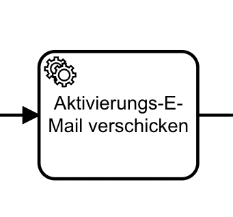

Ein **Service-Task** führt einen externen Service aus.
Diese Art Task eignet sich gut, um Aufgaben an Microservices zu delegieren, wobei die Aufgaben-Delegation in REST-API-Endpunkte und External-Task-Worker unterschieden werden kann.

##### Script-Task

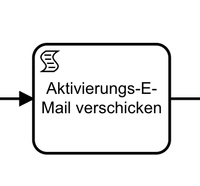

Ein **Script-Task** führt ein Skript aus.
Das Skript ist als Eigenschaft des Tasks definiert und kann mit BPMN Studio bearbeitet werden.
Diese Art Task eignet sich gut, um erste Prototypen größerer Features zu implementieren.

##### User-Task

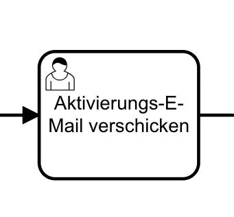

Ein **User-Task** fordert einen Benutzer auf, eine manuelle Aktion durchzuführen, wie bspw. die Bestätigung eines Vorgangs oder die Eingabe von Daten.
Diese Art Task eignet sich gut, um manuelle Prozesse schrittweise zu digitalisieren.

#### Gateways

##### XOR-Gateway

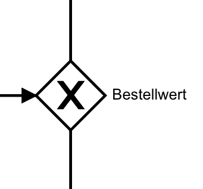

XOR-Gateways bilden Exclusik-Oder-Verzweigungen, bei denen genau ein Pfad auf Basis der am Gateway notierten Bedingung gewählt und dann abgelaufen wird.
Es gibt weitere Arten von Gateways, um bspw. parallel auszuführende Workflows zu beschreiben.

#### Event

##### Start-Event

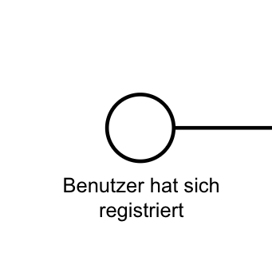

Jeder Prozess besitzt mindestens ein Start-Event.
Start-Events können manuell, bspw. durch ein Skript wie in unserem "Hello World", durch nachrichtenbasierte sowie zeitlich gesteuerte Ereignisse ausgelöst werden.

##### End-Event

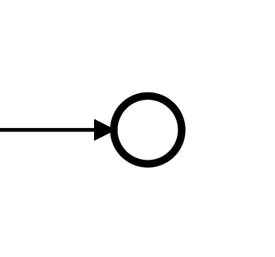

Jeder Prozess besitzt mindestens ein End-Event.
Mit Erreichen eines End-Events ist die Prozessausführung beendet.

### ProcessEngine: Clients in vielen Programmiersprachen und eine standardisierte JSON-API

Die ProcessEngine verfügt über eine standardisierte JSON-API zur Steuerung von Prozessen.

Für die ProcessEngine-API existieren Clients in TypeScript, JavaScript, .NET C# und Python.
Da es sich um eine offen spezifizierte Schnittstelle handelt, können Clients in weiteren Sprachen mit geringem Aufwand erstellt werden.

## Philosophie

### Wir entwickeln Software miteinander!

ProcessEngine ermöglicht die Anbindung von Microservices, nachrichtenbasierten Systemen und die leichte Verkettung von Komponenten.
Hierdurch erreichen wir eine transparente Choreographie der angeschlossenen Systeme und Orchestrierung von Abläufen.

Neu und wichtig ist, dass jeder im Team die Abläufe begreifen und validieren kann.
Die Software dokumentiert sich dank der Verwendung von BPMN selbst.
Das Diagramm ist Code und Dokumentation zugleich.
So bleibt die Dokumentation immer aktuell und "lügt nie".

Wenn Sie noch weitere Fragen haben, so [kontaktieren Sie doch das Team von 5Minds](https://5minds.de)!
