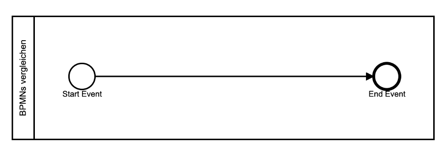
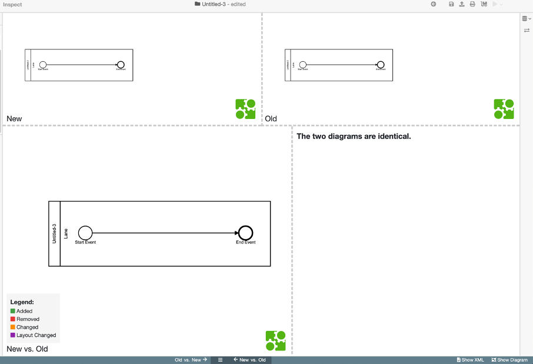
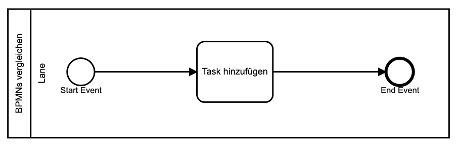
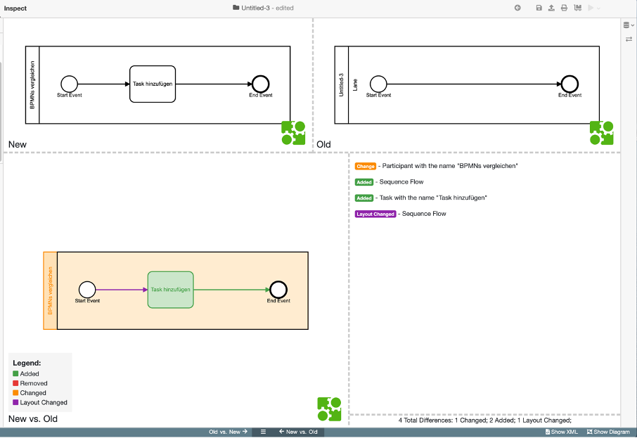
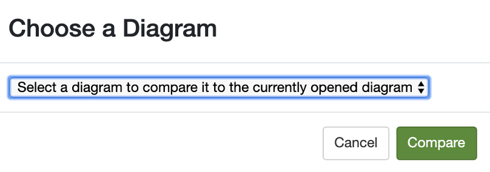
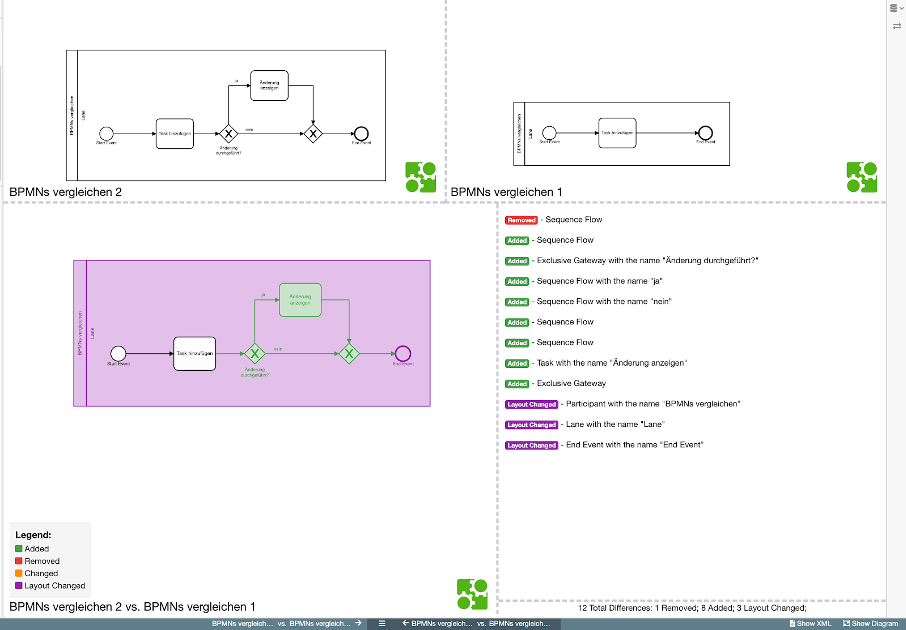

# BPMN-Diagramme vergleichen

In diesem Abschnitt beschreiben wir Ihnen, wie Sie BPMN-Diagramme miteinander vergleichen können.
Im ersten Teil erstellen wir ein BPMN-Prozess und stellen dessen Änderungsverlauf visuell dar. Dieser Verlauf verschafft uns einen Überblick über den Fortschritt des Diagramms. Anhand der farblichen Darstellung der Änderungen, können Sie sehen, wie sich der Prozess schrittweise durch Hinzufügen von neuen Elementen entwickelt hat. 
Im zweiten Teil vergleichen wir zwei Diagramme unabhängig ihrer Modellierung miteinander und zeigen die Unterschiede auf. Diese Unterschiede werden ebenfalls farblich dargestellt.

### Änderungsverlauf eines BPMN-Diagramms
#### Wie können Sie ein neues BPMN-Diagramm erstellen?
Im Folgenden erstellen wir ein neues BPMN-Diagramm. Zum Start bietet das BPMN-Studio wie folgt eine Vorlage mit einem Start- und einem End-Event in einem Prozesspool an.

Durch das Klicken der Schaltfläche Show Diff  (unten rechts in der Anwendung) zeigt das Programm die Änderungen des Diagramms im Diff Protokoll an. Da sich bis jetzt keine Änderungen ergeben haben, liefert das Diff Protokoll noch kein Ergebnis.

#### Wie können Sie das neu erstellte Diagramm erweitern?
Das Diagramm erweitern Sie, indem Sie wie in der Abbildung angezeigt, einen neuen Task hinzufügen.

Sobald Sie dem Diagramm neue Elemente hinzugefügt haben, können Sie sich die Änderungen unter Show Diff als Protokoll anzeigen lassen. In der Abbildung ist das Fenster in vier Bereiche unterteilt. Oben rechts ist  das Diagramm im Anfangszustand. Auf der linken Seite können Sie das Diagramm in der veränderten Version betrachten. Im Bereich unten links stellt das Diagramm die Veränderungen farblich dar. 

Die Farbe symbolisiert die Art der Änderung, die Sie durchgeführt haben, und wird zusätzlich unten links in der Legende angezeigt:

* Hinzugefügt (grün)
* Entfernt (rot)
* Geändert (orange)
* Layout geändert (lila)

Im Bereich unten rechts wird das Protokoll ebenfalls farblich entsprechend der Legende aufgelistet.

### Vergleich von zwei BPMN-Diagrammen
In Teil 2 vergleichen wir zwei unterschiedliche Diagramme miteinander. Zunächst klicken wir auf die Schaltfläche Show Diff. Ein Fenster öffnet sich zum Vergleich von zwei Diagrammen. Dann wählen wir die Datei aus, mit der wir das aktuelle Diagramm vergleichen wollen.

Auf dem oberen Bereich der Anwendung sind beide zu vergleichenden Diagramme wie folgt dargestellt. Unterschiede, welche im Diagramm 1 im Vergleich zu Diagramm 2 erkennbar sind, werden unten links farblich dargestellt. 

Pools und Lanes stellen die Verantwortlichkeiten in einem Prozess dar. Ein Pool repräsentiert etwa ein Unternehmen oder eine Organisation. Ein Lane repräsentiert dagegen verschiedene Abteilungen, Rollen oder Personen in einem Prozess und damit die Prozessteilnehmern bzw. “Participant”. In diesem Fall haben wir das Layout des “Participant” vergrößert und ist in der Farbe Lila gekennzeichnet. Darüber hinaus haben wir weitere Elemente hinzugefügt, die in der Farbe grün erkennbar sind. Die zu unterscheidenden Elemente werden unten rechts im Protokoll farblich dokumentiert.

